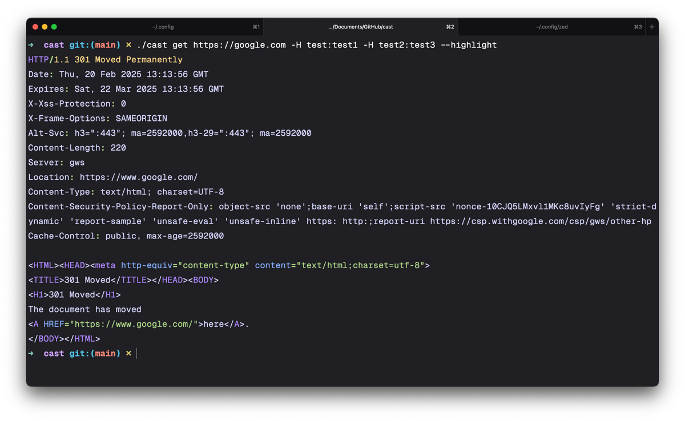

# cast

A CLI tool to enable easy HTTP requests to be completed via the CLI or file-based workflows.

> [!NOTE]
> This is under active development. It is unstable.

**Using It:**

```bash
cast post https://example.com/api/v1/userUpdate -B newName=Greg -H X-Api-Key:12320f-r434rf-g3tg45
```

[](https://asciinema.org/a/lKxrZCiO2oF70hl9kweiBrggm)

HTTP and OpenAPI are great standards. **This tool revolves around _just_ them.**

The focus of the CLI input and file-based scripting is to keep it simple and obvious, which requires being a little explicit. Things like:

- Methods are required. We don't choose a default for you.
- The protocol is required. We don't assume what you're using.
- Past that, the order doesn't matter, but it is broken up by flags to ensure it's obvious you're putting something in a header, vs. a body, vs. calling a different argument.

**Guiding Ethos**

- [Clear is better than clever](https://go-proverbs.github.io)
- [Every tool is targeted towards a specific use and thrive in specific scenarios](https://news.ycombinator.com/item?id=43239153)

## install

### pkg repos

#### macOS

- homebrew: `brew install cast`

#### linux

- pacman (arch via aur): ``

### build it

**With gorealeaser:**

**With go:**

## example(s) / usage

### cli usage

```bash
cast [ method ] [ url ] <args>
```

- anything after the url isn't required.
- the method _then_ url order cannot change.
- output is _just_ the full first response by default.

**GET Request with Custom Headers and Syntax Highlighting:**

```bash
cast get https://google.com -H test:test1 -H test2:test3 --highlight
```



### file usage

Requests are separated mainly by `<% operations %>` and `methods`. They also can be separated by asserts, as it's something the tool matches on, but **asserts are not required**. So after a requests body it'll keep looking and won't start a new request until it finds a `{{ method }} {{ endpoint }}`.

Comments can be included before methods, or after asserts. If you don't want to assert but need to leave comments directly after a body, just do: `<% null %>` and leave the comments after it. A clear endpoint for the body is important.

Asserts are separated from each other by newlines, and from the body by two newlines. If, for whatever reason, the exact string `ASSERT` is needed in the body after two newlines, it can be escaped: `ASS\ERT`. The backslash will be auto-removed by the program post-assertions checks for any string that exactly matches that.

A `Host` header **is required** for clarity. Even though in a normal HTTP interaction it technically wouldn't be required, for the scripts it is.

- `save` works to temporarily save a value, and doubles as an `assert`.
- `[function] [location] <modifier> [value] <modifier>` is a good way to see the post-response functionality.
- If one default is defined on the first use of one variable, it'll count as the default for the rest of its uses.
- If a variable is hardcoded, it'll will act as the default.
- Content-type will be auto-assigned if one isn't entered.

```bash
# Authentication Sequence
[vars]
base_url = "https://api.example.com/v1"
uuid = uuid()
env_token = env.get("API_TOKEN")
host_header = "Host: example.com"

[request]
POST /auth HTTP/1.1
{{ host_header }} # The host header is required.
# Content-Type: application/json - will be auto-detected and set
X-Request-ID: {{ uuid }}

{
  "user": "{{ user }}",
  "pass": "{{ env_token }}"
}

[assert]
status 200
header "Location"
header NOT "X-Rate-Limit"

[vars]
auth_token = "$.token"

# Request Resources Endpoint
[request]
GET /resources HTTP/1.1
{{ host_header }}
Authorization: Bearer {{auth_token}}
```

## quick comparisons

### with httpie

### with hurl

### with xh

### with cURL

### benchmark

## issues, contributions, faqs

_Warning: Not all issues or feature requests may be accepted._

- `.md` on how to [submit an issue]()
- `.md` on how to [contribute]()
- `.md` containing [the faq]()

Generally the program _shouldn't_ load / initiate / do anything that isn't involved in **only** the thing the user commands it. And the things it _does_ do, shouldn't be done until they're needed.

## roadmap / to-do

> [!WARNING]
> Any version under v1.0 is going to be **very** unstable and subject to change (flags, syntax, etc.). Please report any bugs or issues.

### cli focus (<= v0.5)

**v0.1**

- [x] HTTP methods + URL
- [x] Custom headers and request body

**v0.2**

- [x] Print request if debug flag is `true`.
- [x] Track duration between request and response
- [x] Improved / useful logging with values being interacted with
- [x] `-UF` or `--uploadfile` to place a file in the request body
- [x] Short response support. Add a print option that just prints the response's status `200 OK`.

**v0.3**

- [x] `-P` flag with `request` argument to print the request as well. Support syntax highlighting of the request.
- [x] `--download < file path >` to store the response body in a user-specified file.
- [x] Flag to allow following redirects and only returning the "final" response.

**v0.4**

- [x] Restructure CLI urfave/cli, abstract it from the singular main.go file as with file-based features it will grow even larger. Break it into functions in two primary files.
- [x] Custom variables
- [x] Cross-run variable storage / .env support (koanf + dotenv)
- [x] Basic export as cURL command flag.

**v0.5**

- [ ] Get command and flag suggestions working.
- [ ] Go through require semantic versioning and then the cli guidelines site. Refactor and fix as issues are observed. (_Optional_: Finish the CLI book)
- [x] Fix error returning structure and handle errors correctly and in better places.
- [x] Fix logging, make it clearer. Make sure it handles errors well and is human-first and they are helpful to the user. Make sure that only the "advanced" errors bleed through if the debug flag is used. Include helpful suggestions with errors.
- [ ] Get the standard no-common help page setup: https://clig.dev/#help
- [ ] Add a link to where issues should be submitted to the help text. Make sure the issue form for bugs is customized and helpful.

### file focus (> v0.5)

- [ ] File input
- [ ] Assertions
- [ ] Re-work folders to increase clarity
- [ ] Review `fasthttp` byte buffer tricks & best practices to ensure they're utilized correctly, along with pooling (especially regarding multi-request scenarios)

**v0.6**

- [ ] Config
- [ ] Add custom assertion errors to logger.
- [ ] Run a directory (alphabetically / in order) option `cast --directory /tests/auth` (alias `-DIR`). Runs each `.cast` file sequentially.
- [ ] Verify and fill out all CLI help text, instructions, and usage in the flag `.go` files.
- [ ] Regex, size, json assertions.

**v0.7**

- [ ] Support proxying
- [ ] Support client certificates
- [ ] Export as cURL command(s) `cast --curl-export -F auth.cast` (Both file and one-off CLI commands)

**v0.8**

- [ ] Ensure that it easily integrates and performs well if chosen to be run in GitHub actions.
- [ ] Setup goreleaser
- [ ] Reference files to include in the body via their path
- [ ] Wordlist / fuzzing support via the provided vars (`<% varName = ./tests/wordlist.txt %>` or something similar. Will resend the request enough times to iterate through the list. Can only be used in the request it is defined above.)
- [ ] Further standardize success, error, and commit messaging. Add a contribution guide with any styling notes to the repo.
- [ ] Optimize. Review for helpful debug logging (esp. at the beginning, during, and before return).
- [ ] Ensure reproducible and verifiable builds.
- [ ] Make sure to build for both m-series & intel Macs, and verify the executable works on `Fedora` `Endeavour`, and `Alpine` Linux.
- [ ] Make the repo public and set up `goreleaser`.
- [ ] Setup packages with `brew` & `pacman`.
- [ ] Create tests & benchmark tests for all files, flags, args, etc. Have these also run in GitHub.

**v0.9**

- [ ] Dogfood it. Look @ the tests other similar apps run against specific self-hosted services, write them up in `cast`, then fix any issues that arise.
- [ ] Optimize and clarify `README.md`. Check other popular projects for examples.
- [ ] Create the docs site using Astro Starlight.
- [ ] Get feedback from people who would make use of it.
- [ ] Syntax highlighting for editing in Zed.

**v1.0**

- [ ] Create issue templates in GitHub and check labels
- [ ] Ensure GitHub workflows are configured correctly and packaging is essentially automated
- [ ] Run a SAST in the pipeline. Something like Semgrep. Get it plugged into github issues. Also ensure CodeQL is fully configured.
- [ ] Submit application to be an OWASP project (might require a license change?) (evaluate)
- [ ] Announcement posts. Reached the point of having enough features to be useful

### continuing (>= v1.0)

- [ ] optimize. find anti-patterns.
- [ ] maintain. keep on top of package and language changes.
- [ ] advanced cURL export, supports vars + other items.
- [ ] support JSON output for responses so that they can be parsed with tools such as `jq`.
- [ ] add an option to not print info/warning/errors. Ensure it doesn't make the warnings with `y/n` options hang / not complete. (`-q` for quiet)

### separate tooling (>= v1.0)

- [ ] Splitting import / export cURL commands into its own tool
- [ ] Making an OpenAPI import / export separate tool

### _potential_ future plans

These may come about, in addition to others, if enough demand is seen. `cast` is intended to stay as lean as possible, so if only 1% of users want something, it will not be included. If any feature reworks / rollbacks occur, it will only be due to them not being used or causing issues with the application's main purpose (sending and receiving HTTP requests).

- [ ] grpc support
- [ ] graphql support / formatting

## writings about creating it

I wrote a few blog posts on my personal blog about my experience and thoughts while developing `cast`. The are stream-of-thought and show how the scope of the project and its features changed over time. They can be read [here](https://alp1n3.dev/tags/cast/), and exist under the `cast` tag.

## pkgs utilized

The packages doing the heavy lifting (other than the standard library) are:

- [urfave/cli](https://github.com/urfave/cli) (v3)
- [valyala/fasthttp](https://github.com/valyala/fasthttp)
- [charmbracelet/log](github.com/charmbracelet/log)
- [alecthomas/chroma](github.com/alecthomas/chroma/v2) (v2)
- [fatih/color](github.com/fatih/color)

A big thanks to the creators and contributors of them!

## license
